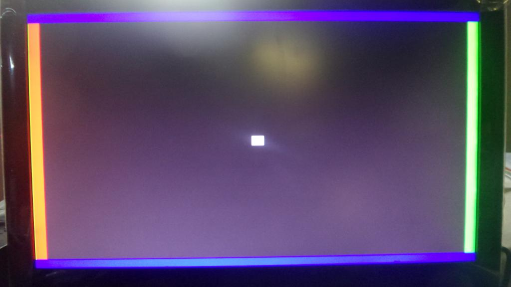

# FPGA_DVITester
A simple FPGA design for testing Digilent RGB2DVI IP core on the Sipeed Tang Nano 20K with GoWin FPGA chip

- Includes Digilent rgb2dvi IP core ported to Tang Nano 20K (GoWin GW2AR-LV18QN88C8/I7)
- Includes demo project that makes use of Digilent rgb2dvi IP core to generate a test pattern on the screen
  (800x600@56Hz resolution)
- There is also a VGA output for the Tang Primer (Anlogic EG4S20BG256), using the Digilent PmodVGA:
  <https://digilent.com/reference/pmod/pmodvga/start>

# Sample Tang Nano 20K HDMI output
  

