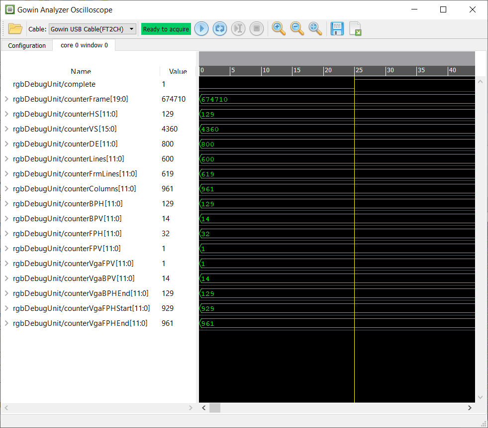
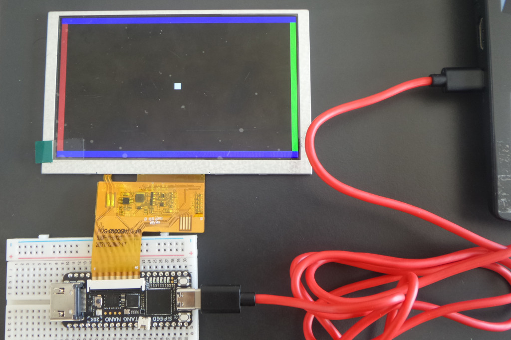

# FPGA_DVITester
A FPGA design for testing Digilent RGB2DVI IP core on the Sipeed Tang Nano 20K with GoWin FPGA chip and HDMI output. There is also some support and examples for the Tang Primer with Anlogic FPGA chip.

- Includes Digilent rgb2dvi IP core ported to Tang Nano 20K (GoWin GW2AR-LV18QN88C8/I7)
- Provides a Verilog implementation of an almost generic RGB signal generator for LCDs and VGA screens
- Provides an RGB_Debug VHDL module implementation for extracting the characteristics of RGB and VGA video signals in their digital format
- Includes demo project for the Tang Nano 20K that makes use of Digilent rgb2dvi IP core to generate a test pattern on the screen (800x600@56Hz resolution), including GAO RGB_Debug example
- Includes demo project for the Tang Nano 20K that generates a test pattern on a 5" LCD screen (800x480), including GAO RGB_Debug
- There is also a VGA output (800x600@56Hz) for the Tang Primer (Anlogic EG4S20BG256), using the Digilent PmodVGA:
  <https://digilent.com/reference/pmod/pmodvga/start>
  
  
# Tang Nano 20K RGB signal characteristics capture by RGB_Debug module

By Combining a combining a custom FPGA module with the GoWin Analyzer Oscilloscope (GAO) we can analyze and extract the RGB and VGA signal characteristics as shown below:

The data above refers to the following signal characteristics:

- 619 lines in total (14 line Vertical Back Porch +  600 pixel lines + 1 lines Vertical Front Porch + 4 lines Vertical Sync.)

- Each line having 1090 pixel clock cycles 
(129 Horizontal Back Porch + 800 pixels width/cycles + 32 cycles Horizontal Front Porch + 129 cycles Horizontal Sync.)

- A total of 674710 clock cycles per frame with a 38.4MHz pixel clock

- 800 x 600 image resolution

# Sample Tang Nano 20K DVI/HDMI output
  

# Sample Tang Nano 20K LCD 5" (800x480) output
  